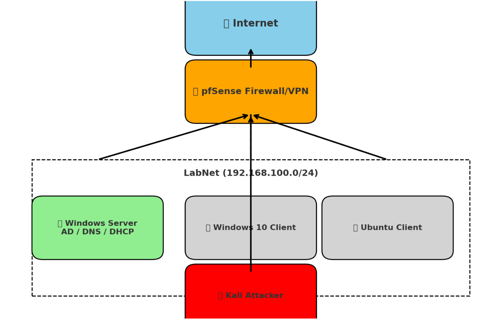

# Enterprise Infrastructure SOC Lab (2025)

**Firewall, Identity, VPN, Access Control, Visibility — designed, implemented, and proven in a controlled lab.**

This project simulates a miniature corporate infrastructure to demonstrate **end-to-end security engineering fundamentals**:  
designing, implementing, breaking/fixing, and proving the core controls that security engineers and SOC analysts depend on.

---

## 🌍 Architecture

- **pfSense** → Firewall, NAT, VPN Gateway (`192.168.100.1`)  
- **SRV-CORE** → Windows Server 2019 (AD DS, DNS, DHCP, File Services) (`192.168.100.10`)  
- **WIN10-CLI** → Domain workstation + Wireshark endpoint  
- **UBU-CLI** → Linux client (routing/DNS drills)  
- **KALI-ATT** → Attacker VM (nmap, brute-force, tcpdump)  
- **VPN** → OpenVPN (`10.8.0.0/24` with push route to `192.168.100.0/24`)  

---

## 🎯 Security Objectives
1. **Perimeter Control** → pfSense firewall rules enforce order, block traffic, log events.  
2. **Identity & Authentication** → Active Directory with Kerberos tickets validated at client + DC.  
3. **Access Control** → Group-based NTFS permissions on hidden share (`Finance$`).  
4. **Remote Access** → VPN tunnel provides controlled access to the corporate subnet.  
5. **Visibility & Detection** → Sysmon telemetry, Windows audit policy, Wireshark packet proof.  

---

## 📊 Implementation Proofs

### 1. Networking – DHCP & DNS
- **Problem:** Without DHCP/DNS, clients fall to APIPA and domain resolution fails.  
- **Action:** Captured **DHCP DORA handshake** in Wireshark; confirmed DNS lookup for `srv.lab.local`.  
- **Solution:** Verified DC leases and DNS resolution working.  
- **Evidence:**  
  - `screenshots/01_dhcp_dora_wireshark.png`  
  - `screenshots/02_dns_nslookup_srv_lab_local.png`  

---

### 2. Perimeter Security – Firewall
- **Problem:** Needed proof that pfSense firewall rules actually enforce order.  
- **Action:** Added block rule for ICMP above allow-any.  
- **Solution:** Client pings dropped; pfSense firewall logs confirmed block.  
- **Evidence:**  
  - `screenshots/03_pfsense_firewall_log_icmp_blocks.png`  

---

### 3. Identity – Active Directory OUs
- **Problem:** Group Policy doesn’t apply in the default *Computers* container.  
- **Action:** Created **Workstations OU** and moved WIN10-CLI into it.  
- **Solution:** Policies scoped cleanly to workstation OU.  
- **Evidence:**  
  - `screenshots/04_aduc_ous_with_win10-cli_in_workstations.png`  

---

### 4. Access Control – Group-based NTFS
- **Problem:** Finance share required least-privilege, auditable access.  
- **Action:** Created hidden share `Finance$`; applied **GG_Finance_RW** group permissions.  
- **Solution:**  
  - Alice (in group) → access allowed  
  - Bob (not in group) → access denied  
- **Evidence:**  
  - `screenshots/05_financeshare_alice_access.png`  
  - `screenshots/06_financeshare_bob_access_denied.png`  

---

### 5. Authentication – Kerberos
- **Problem:** Needed proof Kerberos (not NTLM) was issuing tickets.  
- **Action:** Ran `klist` before and after accessing share; checked DC logs.  
- **Solution:**  
  - Client showed **TGT + TGS (`cifs/srv.lab.local`)**  
  - DC logged **4768/4769/4624** events  
- **Evidence:**  
  - `screenshots/7.1_klist_before.png`  
  - `screenshots/7.2_win10-cli_klist_tgt_tgs.png`  
  - `screenshots/08_eventviewer_security_4768_4769_4624.png`  

---

### 6. Remote Access – VPN
- **Problem:** Needed controlled off-LAN access to internal resources.  
- **Action:** Configured pfSense OpenVPN with pushed route to LAN.  
- **Solution:** Resources only reachable when VPN is connected.  
- **Evidence:**  
  - `screenshots/9.1_pfsense_openvpn_status_connected.png`  

---

### 7. Visibility – Sysmon & Brute-Force
- **Problem:** Needed visibility on endpoint behavior and authentication abuse.  
- **Action:** Deployed Sysmon; simulated brute-force from Kali with Hydra.  
- **Solution:**  
  - Sysmon captured **Event ID 1 (process creation)**  
  - DC security log filled with **4625 failed logons**  
- **Evidence:**  
  - `screenshots/10_sysmon_eventid1_process_creation.png`  
  - `screenshots/11.1_eventviewer_security_4625_failed_logons.png`  
  - `screenshots/11.2_eventviewer_security_4625_failed_logons.png`  

---

## 🧯 Break → Symptom → Fix
- DHCP off → Clients get APIPA `169.254.x.x` → Restart DHCP → renew lease.  
- DNS wrong → `srv.lab.local` fails → Reset DNS to `192.168.100.10`.  
- Missing gateway → LAN OK, Internet dead → Restore pfSense `.1`.  
- Kerberos fail → Time skew > 5 mins → Resync NTP, fix DNS.  
- Firewall rule order → Block below allow-any ineffective → Move block above.  

---

## 🛡️ Detection Scenarios
- **Baseline:** Normal Kerberos ticket issuance confirmed (`klist` + DC logs).  
- **Attack:** Brute-force from Kali → surge of 4625 failed logons.  
- **Response:** Correlated Sysmon Event ID 1 (powershell.exe) with failed logons.  
- **Outcome:** Validated full detection pipeline: endpoint → DC → firewall.  

---

## 📚 Lessons Learned
- DNS is the backbone of AD authentication.  
- Firewall rule **order** determines control.  
- Group-based access (AGDLP) is scalable; per-user ACLs break.  
- Packet captures prove what logs imply.  
- Visibility is mandatory: without Sysmon + audit, brute-force goes unseen.  

---

## 🎓 Skills Demonstrated
- **Identity & Access:** AD DS, Kerberos, NTFS, OUs, Groups  
- **Networking:** DHCP, DNS, NAT, routing, VPN  
- **Perimeter:** pfSense firewall rule design + logs  
- **Endpoint Visibility:** Sysmon telemetry, Windows audit policy  
- **Detection Engineering:** Brute-force + Kerberos monitoring  
- **Troubleshooting:** Break/fix drills under pressure  

---

## ⚠️ Ethics
All offensive simulations (nmap, brute-force) were executed only in an **isolated lab environment**.  
No production systems were targeted.

---

*© 2025 – Enterprise Infrastructure SOC Lab: proving design, implementation, and validation of security controls.*
